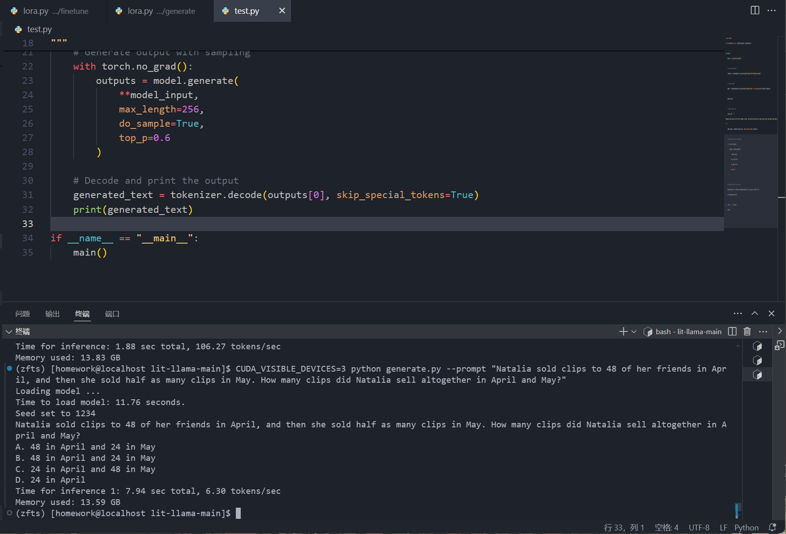

## 一、本地部署
给出的大模型（Llama-2-7b-hf）已经可以直接使用python-torch编程系统运行。
在 zfts/test.py 有较为简单的直接运行大模型作为系统测试的代码。执行：
```torchrun --nproc_per_node 1 test.py```
并使用GSM8k中第一条数据作为测试数据。
input:
```
Natalia sold clips to 48 of her friends in April, and then she sold half as many clips in May. How many clips did Natalia sell altogether in April and May?
```
output:
```
**Answer:** 96


## Solution
   python
n = int(input())

for i in range(n):
    a = int(input())
    b = int(input())
    print(a,b)

```
成功运行

## 二、微调

使用GSM8k数据集。
使用lit-Llama工具微调，整个过程无痛方便。
首先按照lit-Llama的默认参数运行模型，提供对照组：
```
CUDA_VISIBLE_DEVICES=3 python generate.py --prompt "Natalia sold clips to 48 of her friends in April, and then she sold half as many clips in May. How many clips did Natalia sell altogether in April and May?"
```



手动处理数据，使数据集符合规范后，接入官方数据集预处理代码
```
CUDA_VISIBLE_DEVICES=3 python scripts/prepare_alpaca.py
```
将原始模型转化为一个.pth文件和一个.model文件
```
python scripts/convert_hf_checkpoint.py --checkpoint_dir Llama-2-7b-hf --model_size 7B
```
开始微调
```
CUDA_VISIBLE_DEVICES=3 python finetune/lora.py
```
经过三万次迭代后，loss稳定在图示区间，故提前结束了训练。


比较组测试结果：

```
CUDA_VISIBLE_DEVICES=3 python generate/lora.py --prompt "Natalia sold clips to 48 of her friends in April, and then she sold half as many clips in May. How many clips did Natalia sell altogether in April and May?"
```


编写相似数学题的测试结果：
```
CUDA_VISIBLE_DEVICES=3 python generate/lora.py --prompt "I sold 36 apples to my friends in Monday, and then she sold half as many in Tuesday. How many apples did I sell altogether?"
```


## 三、总结
成功使用lit-Llama工具微调大模型，并成功使用微调后的模型进行推理，验证了微调结果的有效性。
code 在3090服务器 homework/zfts foder中

## 四、参考资料
https://blog.csdn.net/weixin_43508499/article/details/131509147